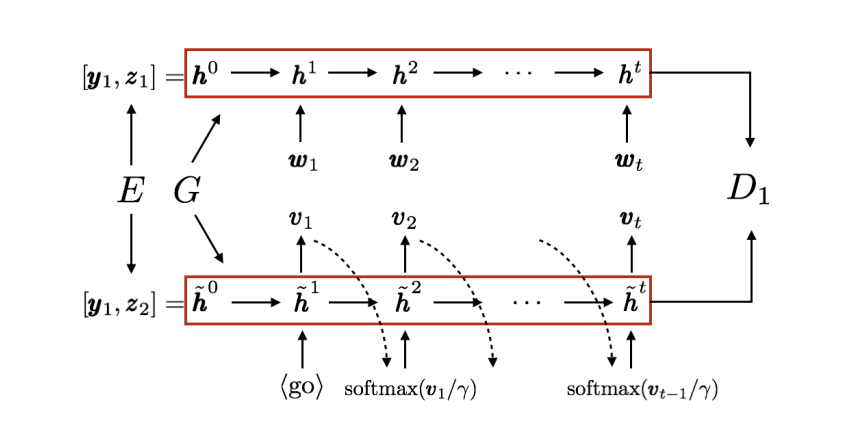

# Language Style Transfer



A Tensorflow implementation of [NLP Style Transfer from Non-parallel Text with Adversarial Alignment](https://arxiv.org/abs/1705.09655). Repo applies the work unto Shakespearean works. It provides prototypes for seq2seq models with teacher-enforcement as well as plots of the encoding layer.

## Getting the Dataset
Shakespearean texts are taken from [this repository](https://github.com/cocoxu/Shakespeare). All works are aligned by line.

## Getting Started
You should have two folders of data, one of style A and one of style B. Each directory should contain a or several files with each sentence separated by a newline.

To parse the data, use dataset.py:
```
  python dataset.py [-c] $SOURCE_PATH_1 $SOURCE_PATH_2 $PICKLE_PATH
```
This will create a pickled file containing a dictionary of the two datasets as well as a sklearn one-hot encoder that contains the mappings of index to word/character.

Use this object to train the aligned autoencoder.
```
  python autoencoder.py $PICKLE_PATH $NUM_EPOCHS
```
This will create a model in models/ directory. The model will contain trained weights, loss of the two autoencoders, and the adversarial loss. You can examine the plots with tensorboard.
```
  tensorboard $MODEL_PATH
```

## Citation
If you use this implementation of the work, use the following citation:
```
@misc{2017language-style-transfer,
  author = {Jin Park},
  title = {Language Style Transfer},
  year = {2017},
  howpublished = {\url{https://github.com/jpark96/language-style-transfer}},
  note = {commit xxxxxxx}
}
```

## Authors
[Jin Park](https://github.com/jpark96) 
